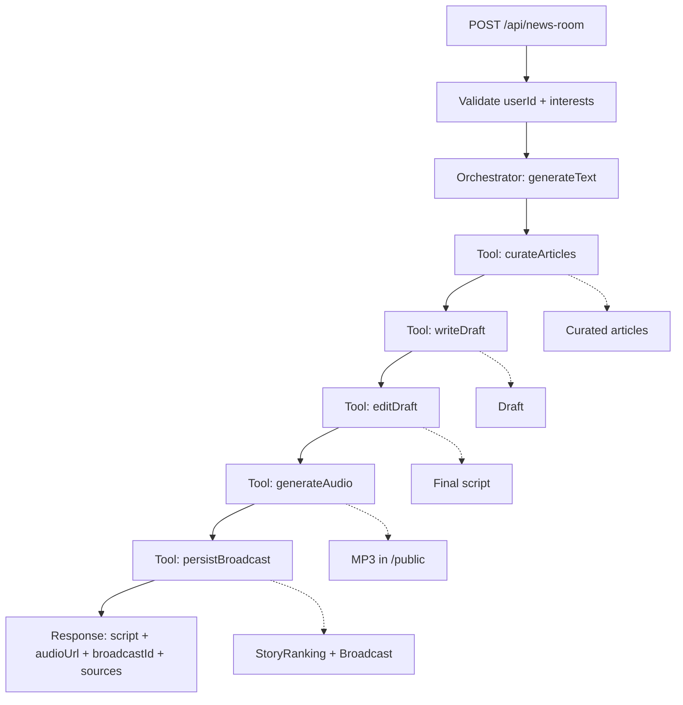

## Personal News Anchor

An AI newsroom that ingests news, ranks stories by user interests, writes a broadcast script, and generates a personalized audio briefing.

### What’s Implemented (Assignment Mapping)

- Phase 1 Day 1: Summarizer API is implemented in `app/api/summarize/route.ts`.
- Phase 1 Day 2: Story ranking API is implemented in `app/api/select-stories/route.ts`.
- Phase 2 Day 3: News ingestion + embeddings are implemented in `app/api/ingest/route.ts`.
- Phase 2 Day 4: Semantic search + RAG summaries are implemented in `app/api/search/route.ts`.
- Phase 3 Day 5: Tools + fact checking are wired via `app/lib/tools/*` (currently mock).
- Phase 3 Day 6: Sequential agent pipeline (Curator → Journalist → Editor-in-Chief) is implemented in `app/api/news-room/route.ts`.
- Phase 4 Day 7: Preferences + broadcast history stored in Postgres via Prisma models and `/api/user`, `/api/preference`, `/broadcast`.
- Phase 5 Day 8: TTS audio generation is implemented in `app/api/tts/route.ts` and `app/api/news-room/route.ts`.
- Phase 6 Day 9–10: Frontend flows exist for onboarding, listen experience, and admin utilities.

### High-Level Architecture

1. **Ingest** news from RSS sources.
2. **Embed** articles and store them in Postgres with vector search.
3. **Curate + Rank** stories for a user’s interests.
4. **Write** a draft brief with tool-aware journalist logic.
5. **Edit** into a final broadcast-ready script.
6. **Generate audio** with Vercel AI SDK TTS.
7. **Store** broadcasts and serve them to the user in the Listen UI.

### Data Flow (Admin)

- Admin visits `/admin/ingest` → calls `POST /api/ingest`.
- `/api/ingest` fetches RSS articles, embeds them, stores them in `Article`.
- Admin visits `/admin/search` → calls `POST /api/search`.
- `/api/search` performs vector search + RAG summary, returns answer + sources.
- Admin visits `/admin/newsroom` → calls `POST /api/news-room`.
- `/api/news-room` runs Curator → Journalist → Editor-in-Chief, stores `StoryRanking` + `Broadcast`, and generates MP3.

### Data Flow (Direct User)

- User visits `/` → enters email → `POST /api/user` (create/find user).
- User saves interests → `POST /api/preference`.
- User clicks “Generate” on `/listen` → `POST /api/news-room` with interests + userId.
- `/api/news-room` builds a script + audio, stores `Broadcast`, and writes MP3 to `/public`.
- `/listen` loads history via `GET /broadcast?email=...` and plays audio.

### Agentic Flow Graph (Current)

Mermaid graph of the current agentic flow in `app/api/news-room/route.ts`:



Programmatic access to the same Mermaid source lives in
`app/lib/graphs/newsroomFlow.ts` and can be used to render a graph in docs or UI.

### Endpoints

- `POST /api/summarize` — summarize text to a neutral brief.
- `POST /api/select-stories` — rank stories by user interests.
- `POST /api/ingest` — fetch RSS, embed, store articles.
- `POST /api/search` — semantic search + RAG answer.
- `POST /api/news-room` — Curator → Journalist → Editor pipeline + TTS.
- `POST /api/journalist` — single-step journalist with tools.
- `POST /api/tts` — generate audio for an existing broadcast.
- `POST /api/user` — create/find user by email.
- `POST /api/preference` — save user interests.
- `GET /api/preference` — fetch preference(s).
- `GET /broadcast` — fetch broadcasts by user email.

### Database Models (Prisma)

Core models are defined in `prisma/schema.prisma`: `Article`, `Summary`, `StoryRanking`, `User`, `Preference`, `Broadcast`.

### Agentic Flow vs Workflow

This is a **workflow with agentic components**:

- **Workflow**: The pipeline is a fixed sequence (Curator → Journalist → Editor).
- **Agentic elements**: The Journalist can invoke tools (`factCheck`, `getWeather`) and the system supports tool calls and multi-step reasoning.
- **Current limitation**: Tool implementations are mocked, so it’s not fully autonomous.

### Mocked / Placeholder Parts To Replace

- `app/lib/tools/factCheck.ts` — mocked fact verification.
- `app/lib/tools/waether.ts` — mocked weather enrichment.
- `app/admin/newsroom/page.tsx` sends `{ topic }` but `POST /api/news-room` expects `{ interests, userId }`.
- `app/dashboard/page.tsx` calls `/api/newsroom` (route does not exist).
- `app/lib/news/fetchGlobalNews.ts` uses GNews API but ingestion uses RSS; likely unused.

### Setup

Environment variables required:

- `OPENAI_API_KEY`
- `DATABASE_URL` (Postgres + pgvector)
- `GNEWS_API_KEY` (only if you use `fetchGlobalNews.ts`)
- `FACT_CHECK_API_KEY` (Google Fact Check Tools API, optional but recommended)

Install and run:

```bash
npm install
npm run dev
```
